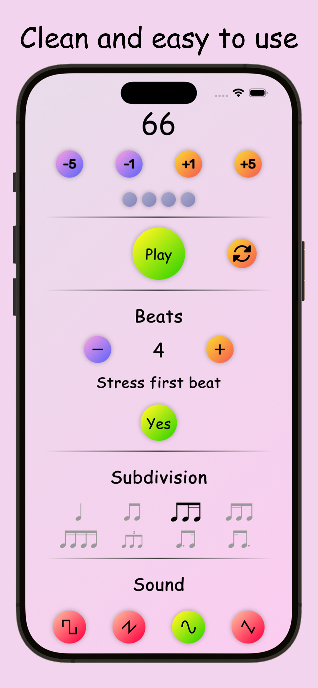
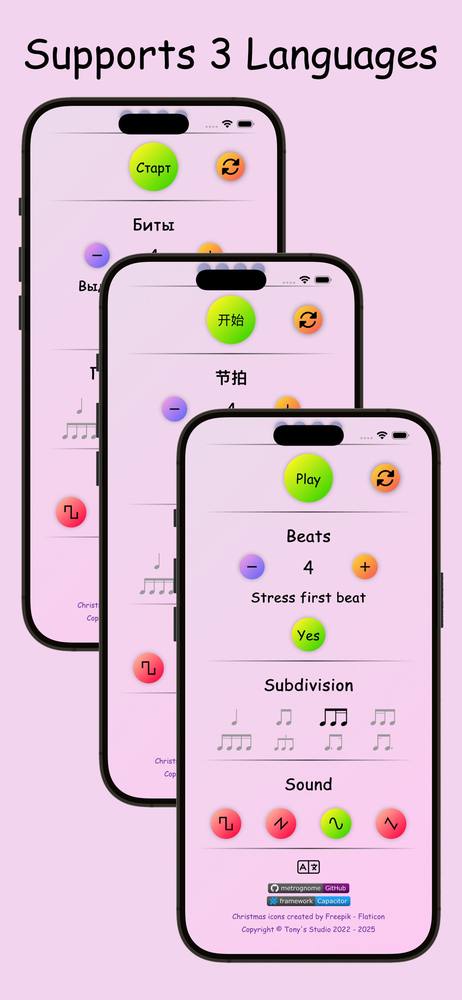
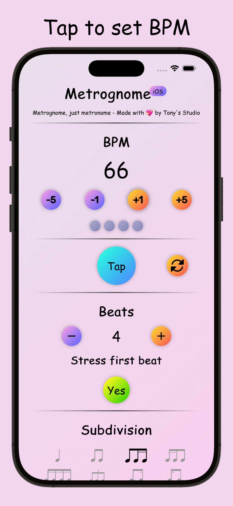

# Metrognome

Copyright &copy; Tony's Studio 2022 - 2026

---

[](https://github.com/Lord-Turmoil/metrognome/actions/workflows/static.yml)

## Overview

This project aims to provide a minimalist metronome for musicians without any unnecessary features.

## Try it now!

- [x] [Web App](https://metro.tonys-studio.top/)
- [x] [Android App](https://github.com/Lord-Turmoil/metrognome/releases/latest/download/metrognome-1.5.2.apk)
- [x] [iOS App](https://apps.apple.com/app/id6753041104)

<div style="text-align: center;">
    
    
    
</div>

## Development

Metrognome is developed with [Capacitor](https://capacitorjs.com/) using native HTML, CSS, and JavaScript. See the official [Capacitor documentation](https://capacitorjs.com/docs) for more information.

First of all, run `npm install` in the root directory to install dependencies. There is a local plugin [capacitor-metronome-background](plugins/capacitor-metronome-background) to handle native background service for metronome. You need to build the plugin before building the app. To build the plugin, run the following command:

```bash
# build the plugin
cd plugins/capacitor-metronome-background
npm run build
cd ../..

# build the app
npm run build

# sync the app with native platforms
npm run sync
```

For production, you can set several environment variables to configure the app:

- `VITE_BASE_URL`: The base URL for the meta files and Android APK. It should point to a static file hosting service serving contents in the [publish/](publish/) directory.
- `VITE_WEB_URL`: The URL of the Web App.
- `VITE_APP_STORE_URL`: The URL of the app on the iOS App Store.
- `VITE_CLARITY_KEY`: The key for [Microsoft Clarity](https://clarity.microsoft.com/). This is optional and only used for web analytics.

### Web

Standard [Vite](https://vite.dev/) project.

### Android

Since Android platform is generated by Capacitor, those files are not included in this repo. To add Android project, run the following command:

```bash
npx cap add android
npx capacitor-assets generate --android
npx cap open android
```

After that, may manually add the following permissions to `AndroidManifest.xml`:

```xml
<uses-permission android:name="android.permission.INTERNET" />
<uses-permission android:name="android.permission.FOREGROUND_SERVICE_MEDIA_PLAYBACK" />
<uses-permission android:name="android.permission.WAKE_LOCK" />
```

### iOS

> See [iOS Requirements](https://capacitorjs.com/docs/getting-started/environment-setup#ios-requirements) for iOS development environment setup.

Since iOS platform is generated by Capacitor, those files are not included in this repo. To add iOS project, run the following command:

```bash
npx cap add ios
npx capacitor-assets generate --ios
npx cap open ios
```

After that, it requires UIBackground Modes capability to be enabled in Xcode with the "Audio, AirPlay, and Picture in Picture" option checked.
